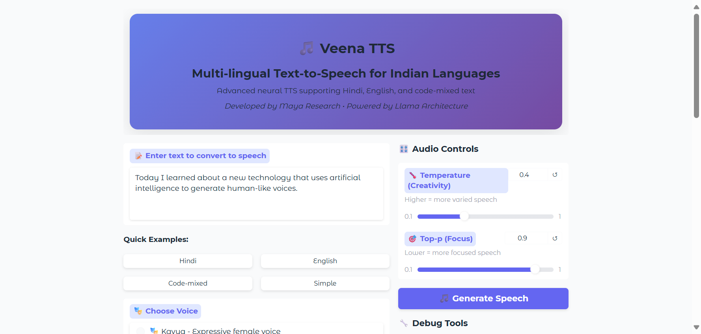

# 🎵 Veena TTS - Gradio Web Interface



> ⚠️ **Warning:** There is a known issue with the speakers – currently, only one or two voices work reliably. If you know how to fix this, please consider submitting a pull request!

A beautiful and intuitive web interface for the **Veena Text-to-Speech model** developed by Maya Research. This Gradio application provides an easy-to-use interface for generating high-quality speech in Hindi, English, and code-mixed text.

## ✨ Features

- **🌍 Multi-lingual Support**: Hindi, English, and code-mixed text
- **🎭 4 Distinct Voices**: Choose from Kavya, Agastya, Maitri, and Vinaya
- **🎛️ Advanced Controls**: Adjust temperature and top-p for speech variation
- **📱 Responsive UI**: Modern, mobile-friendly interface
- **⚡ Real-time Generation**: Quick speech synthesis with progress tracking
- **🎧 Audio Playback**: Instant playback and download capabilities
- **📝 Quick Examples**: Pre-loaded example texts in different languages

## 🚀 Quick Start

### Prerequisites

#### Mainly i tested in these idk about the others so try and let me know 💖

| Requirement                  | Recommended Version                                                         |
| ---------------------------- | --------------------------------------------------------------------------- |
| Python                       | **3.9 – 3.12**                                                              |
| PyTorch                      | **≥ 2.2.0** (built with CUDA 12.1)                                          |
| CUDA Toolkit (NVIDIA driver) | **CUDA 12.1** runtime (Driver ≥ 545)                                        |
| NVIDIA GPU                   | RTX 30-series/40-series <br> **≥ 6 GB VRAM** (≥ 12 GB strongly recommended) |
| System RAM                   | ≥ 16 GB                                                                     |

On Linux/Windows the official PyTorch wheels already include the necessary CUDA libraries – a separate toolkit install is **not** required. If you are running on a laptop GPU with <6 GB VRAM or on CPU-only hardware you can still launch the app (see the _CPU fallback_ section) but generation will be slow.

### Installation

1. **Clone or download the application files**

2. **Install dependencies**:

   ```bash
   pip install -r requirements.txt
   ```

3. **Run the application**:

   ```bash
   python app.py
   ```

4. **Open your browser** and navigate to:
   ```
   http://localhost:8000
   ```

## 🎯 Usage Guide

### Basic Usage

1. **Enter Text**: Type or paste your text in Hindi, English, or code-mixed format
2. **Choose Voice**: Select from 4 available speakers:

   - 🎭 **Kavya** - Expressive female voice
   - 🎯 **Agastya** - Clear male voice
   - 💫 **Maitri** - Friendly female voice
   - 🎪 **Vinaya** - Warm male voice

3. **Adjust Settings** (optional):

   - **Temperature**: Controls creativity/variation (0.1-1.0)
   - **Top-p**: Controls focus/coherence (0.1-1.0)

4. **Generate**: Click "🎵 Generate Speech" and wait for processing

### Example Texts

The interface includes quick example buttons for:

- **Hindi**: Complex sentences in Devanagari script
- **English**: Standard English text
- **Code-mixed**: Hindi-English mixed sentences
- **Simple**: Basic test phrases

### Advanced Tips

- **Short texts** (1-2 sentences) work best for quality
- **Lower temperature** (0.2-0.4) for more consistent speech
- **Higher temperature** (0.6-0.8) for more expressive speech
- **Different speakers** have unique characteristics - experiment!

## 🔧 Technical Details

### Model Information

- **Architecture**: 3B parameter Llama-based transformer
- **Audio Quality**: 24kHz SNAC neural codec
- **Quantization**: 4-bit NF4 for efficient inference
- **Languages**: Hindi, English with code-mixing support
- **Latency**: Sub-80ms on H100, ~200ms on RTX 4090

### Dependency Matrix

| Package                                  | Tested Version    |
| ---------------------------------------- | ----------------- |
| `torch`                                  | 2.2.2 + CUDA 12.1 |
| `torchaudio`                             | 2.2.2             |
| `transformers`                           | 4.52.4            |
| `bitsandbytes`                           | 0.43.0            |
| `snac`                                   | 0.1.5             |
| `gradio`                                 | 4.27.0            |
| `soundfile`, `numpy`, `scipy`, `librosa` | latest            |

Install all dependencies with:

```bash
pip install -r requirements.txt
```

### GPU vs CPU behaviour

The application auto-detects a CUDA-capable GPU:

- **GPU available →** loads Veena in 4-bit NF4 quantisation using `bitsandbytes` (`device_map="auto"`). This is memory-efficient (≈5 GB VRAM) and fast.
- **No GPU detected →** falls back to full-precision (FP16/FP32) _CPU_ inference. Expect **~50× slower** generation and ≈12 – 16 GB RAM usage. A warning is printed at startup.

No manual switches are required – the logic is handled in `app.py`.

### Performance Notes

- First run will download ~8GB of model files
- Initial model loading takes 30-60 seconds
- Subsequent generations are much faster
- GPU required for reasonable performance

**🔬 Tested configuration:** Windows 11 (22H2) • Python 3.10 • NVIDIA RTX 3070 Laptop GPU (8 GB VRAM) • Driver 546.xx • CUDA 12.1 wheels. Other comparable Ampere/ADA GPUs should behave similarly.

### Troubleshooting

**Common Issues:**

1. **CUDA out of memory**: Reduce batch size or use smaller quantization
2. **Model download fails**: Check internet connection and disk space
3. **Audio not playing**: Ensure browser supports WAV playback
4. **Slow generation**: Verify GPU is being used

**Solutions:**

```bash
# Check GPU availability
python -c "import torch; print(torch.cuda.is_available())"

# Monitor GPU memory
nvidia-smi

# Clear cache if needed
python -c "import torch; torch.cuda.empty_cache()"
```

## 🌐 Deployment Options

### Local Development

```bash
python app.py
```

### Production Deployment

```bash
# With custom port and sharing
python app.py --port 7860 --share

# Or modify the launch parameters in app.py
demo.launch(
    server_name="0.0.0.0",
    server_port=8000,
    share=True  # Enable public sharing
)
```

### Docker Deployment

```dockerfile
FROM python:3.9-slim

WORKDIR /app
COPY requirements.txt .
RUN pip install -r requirements.txt

COPY . .
EXPOSE 8000

CMD ["python", "app.py"]
```

## 📝 Model Variants

This interface supports multiple Veena model variants:

- **maya-research/Veena** - Original model (default)
- **Prince-1/Veena-Onnx** - ONNX optimized version
- **hashvibe007/Veena-mlx-4Bit** - MLX optimized for Apple Silicon
- **Prince-1/Veena-Onnx-Int4** - INT4 quantized ONNX
- **Prince-1/Veena-RKllm** - Rockchip RK3588 optimized

To use a different variant, modify the model name in `app.py`:

```python
model = AutoModelForCausalLM.from_pretrained(
    "Prince-1/Veena-Onnx",  # Change this line
    # ... other parameters
)
```

## 🤝 Contributing

Contributions are welcome! Please feel free to submit issues, feature requests, or pull requests.

## 📄 License

This project follows the Apache 2.0 license of the original Veena model.

## 🙏 Acknowledgments

- **Maya Research** - For developing the amazing Veena TTS model
- **Hugging Face** - For hosting and model infrastructure
- **Gradio Team** - For the excellent web interface framework
- **Community** - For quantizations and optimizations

## 🔗 Links

- [🤗 Veena Model Hub](https://huggingface.co/maya-research/Veena)
- [📚 Model Documentation](https://huggingface.co/maya-research/Veena/blob/main/README.md)
- [🐛 Report Issues](https://github.com/your-repo/issues)
- [💬 Discussions](https://huggingface.co/maya-research/Veena/discussions)

---

**Made with ❤️ for the Indian Language AI Community**
